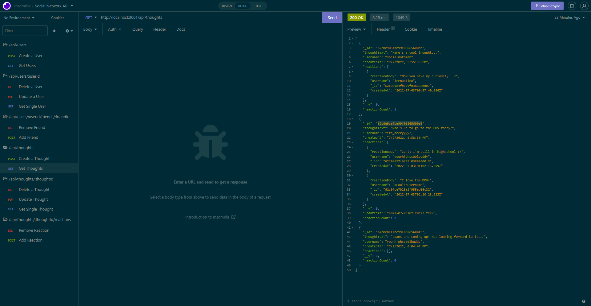
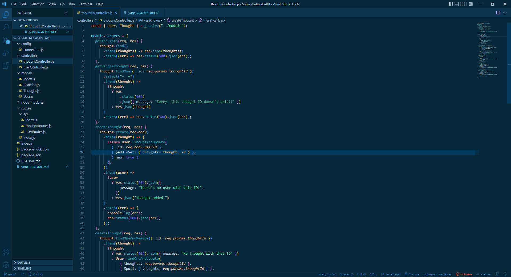

# Social-Network-API




## Description

Why did you decide to build this project?

```
This mock-social-network is an exercise on how to utilize and manipulate data stored in the Mongo Database. Programming the "thoughts" and "reactions" of users was the end result of utilizing CRUD routes (get, post, put, and delete) in a new npm package called mongoose!
```

## Table of Contents

- [Installation](#installation)
- [Usage](#usage)
- [Contributing](#contributing)
- [Tests](#tests)
- [Questions](#questions)

## Installation

How to install:

```
To install:

- Simply go to the repository website and hit the green button at the top, laballed "code"
- Copy the SSH link, and go to your locale machine's directory
- Direct yourself to where you would like the project to be stored, and type "git clone <copy the link here>", and press enter

To run:

- type "npm i" in the terminal to download the project's dependencies
- type "node index" in the terminal

Congrats! You are ready to run the program!
```

## Usage

How does your project work?

```
By using an extension called Mongoose, we are able to manipulate data found in our Mongo Database from the terminal, as well as in our javascript files.
With this go-between, we are able to feed the data into another program (express) and control how the data was displayed, queried, and manipulated.

When you start the program, you will be able to mess around with the CRUD routes to see how your data gets manipulated!
```

## Contributing

How can you contribute to this project?

```
Leave comments!

I want to hear what I can improve on, what I can cut out, and what I can do to elevate this project to the next level!

```

## Tests

To run this program:

```
This is the function for deleting a user. You will notice that this wil not only delete the user, but also delete their thoughts as well!

deleteUser(req, res) {
    User.findOneAndDelete({ _id: req.params.userId })
      .then((user) =>
        !user
          ? res.status(404).json({ message: "No user with that ID" })
          : Thought.deleteMany({ _id: { $in: user.thoughts } })
      )
      .then(() => res.json({ message: "User and thoughts deleted!" }))
      .catch((err) => res.status(500).json(err));
  },
```



## Demonstration

[A Demonstration of the API can be found here!](https://www.youtube.com/watch?v=EN5U8hc0Tco)

## Questions

If you have any questions, you can contact me through:

- [Github](https://github.com/Loggamon)
- Email: scarletfedora@gmail.com

## License & Copyright

© Logan Monson
